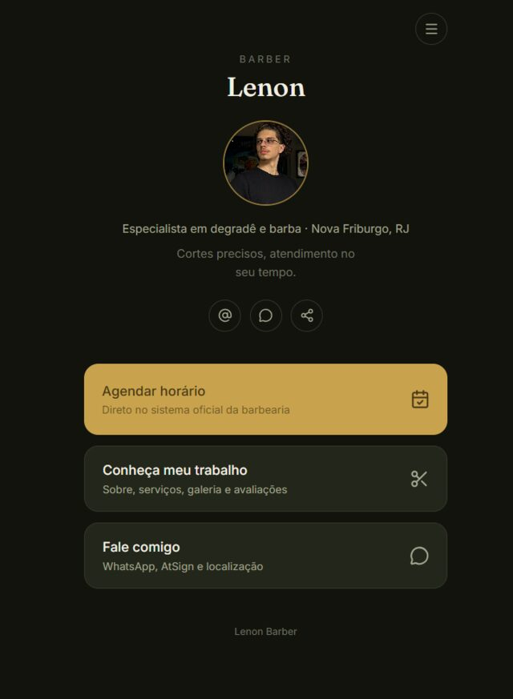
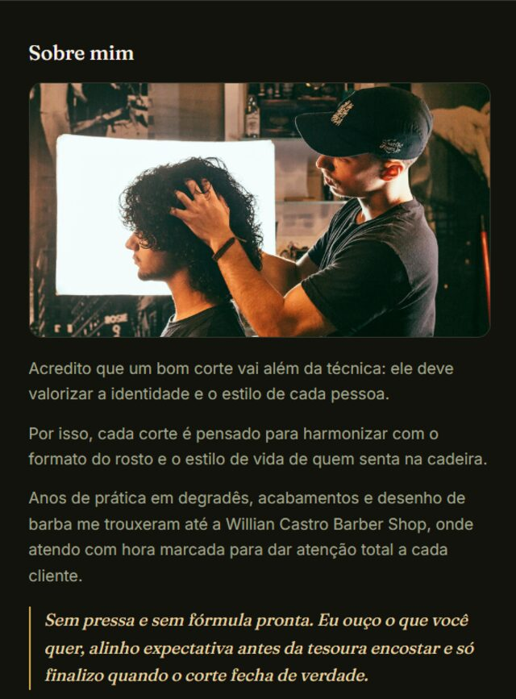
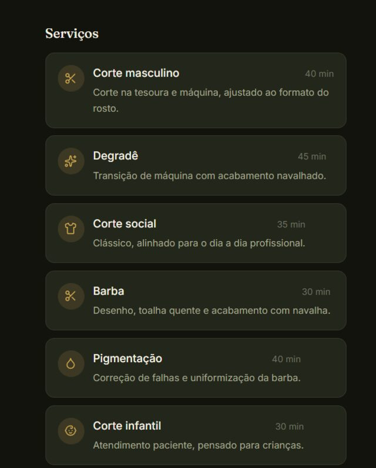
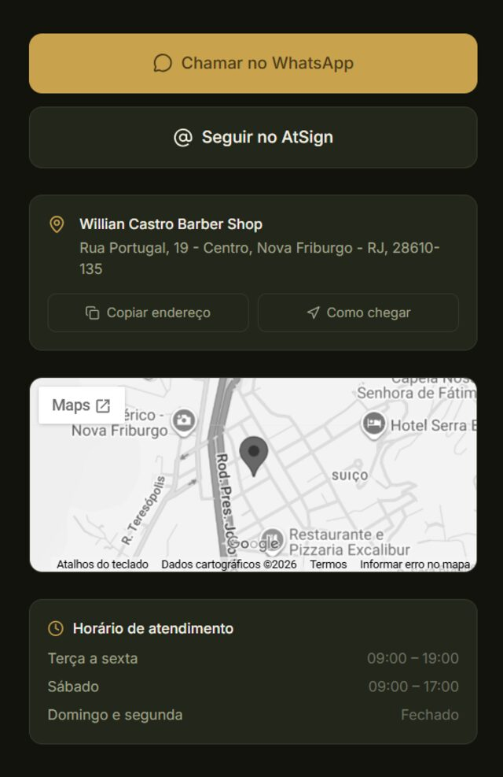

# Lenon Barber — Hub premium (link da bio)

Hub mobile-first que substitui o Linktree/Bio.site tradicional por uma experiência de
agendamento e apresentação profissional para o barbeiro Lenon.

🔗 **Deploy:** [lenonbarber.vercel.app](https://lenonbarber.vercel.app)

| Home | Sobre | Serviços | Contato |
|---|---|---|---|
|  |  |  |  |

## 1. Arquitetura da informação (sitemap)

```
/                → Home (hub): hero + card de agendar (link direto) + 2 cards de navegação
/trabalho        → Sobre mim · Serviços · Galeria · Avaliações · FAQ (rola em uma página só)
/contato         → WhatsApp · Instagram · endereço · mapa · horário
```

Mudança registrada aqui: o card "Agendar horário" deixou de abrir uma página
intermediária explicando o modelo de barbearia parceira — por pedido do cliente,
ele manda direto para o link do sistema oficial de agendamento, sem etapa extra e
sem alternativa de WhatsApp nesse ponto do hub. Quem tiver dúvida sobre o modelo
de atendimento encontra a explicação em Dúvidas frequentes.

Decisão: 3 telas, não mais que isso. Cada uma resolve uma pergunta do visitante
("o que ele faz", "onde/como falo", e agendar que agora é ação direta). Nada de
menu, nada de página institucional separada da de serviços — tudo o que forma
confiança fica junto em `/trabalho`, porque o visitante que clicou ali quer se
convencer de uma vez, não navegar por sub-seções.

## 2. Fluxo de navegação

```
Instagram (bio) → Home → Agendar (link direto) ou [Trabalho | Contato] → ação externa
                                                    (WhatsApp, Maps, sistema de agendamento)
```

Toda página secundária tem um único botão de voltar (seta no topo) — nunca mais de
um clique para retornar ao hub. Nenhuma tela é um beco sem saída.

## 3. Design system

| Token | Valor | Uso |
|---|---|---|
| `--color-ink` | `#12130d` | Fundo base |
| `--color-panel-2` | `#23261b` | Cards |
| `--color-line` | `#34372a` | Bordas |
| `--color-cream` | `#f3efe2` | Texto principal |
| `--color-sage` | `#a2a68f` | Texto secundário |
| `--color-brass` | `#c9a24d` | Acento (CTA principal, destaques) |

- **Tipografia**: `Fraunces` (serifada, com personalidade) para títulos e citações;
  `Inter` para corpo e UI. Contraste clássico/atemporal em vez de uma sans genérica
  em tudo — é o que separa "site de barbearia" de "app corporativo".
- **Cards**: `radius` 16px, borda 1px, sem sombra (sombra em fundo escuro só suja).
- **Card de agendar**: única superfície preenchida com a cor de destaque (brass) —
  é o único CTA "cheio" da Home, o resto é contorno. Isso cria hierarquia sem
  precisar de texto dizendo "clique aqui".
- **Motion**: fade + leve subida (16px) ao entrar na viewport, feito uma vez só
  (`viewport once: true`). Sem parallax, sem efeitos contínuos — o cliente veio do
  Instagram para resolver algo rápido, animação decorativa atrapalha.

- **Menu de navegação rápida (3 traços)**: ícone de menu no canto superior direito
  da Home e de todas as páginas secundárias. Abre um dropdown com atalho direto
  para "Sobre mim", "Serviços" e "Dúvidas frequentes" dentro de `/trabalho`, com
  scroll suave até a seção. Implementado com `navigate(..., { state })` em vez de
  âncora nativa (`#sobre`) porque o app usa `HashRouter` — um `#sobre` nativo
  colidiria com o hash de rota (`#/trabalho`). Ver `src/components/QuickNav.tsx`.

## 4. Estrutura de pastas

```
src/
  components/   # Blocos reutilizáveis (HubCard, Buttons, ServiceCard, Gallery, ...)
  pages/        # Home, Agendar, Trabalho, Contato — uma por rota
  data/         # profile.ts: todo o conteúdo (textos, serviços, depoimentos, FAQ)
  types/        # Interfaces TypeScript do modelo de conteúdo
```

Decisão consciente: **não** criei `hooks/`, `services/` ou `utils/` vazios como o
briefing original sugeria. Pastas sem conteúdo são ruído em um projeto de portfólio —
melhor criar quando a primeira necessidade real aparecer (ex.: um hook de scroll
lock quando a galeria crescer).

## 5. Stack e por que

- **Vite + React + TypeScript**: padrão de mercado, build rápido, fácil de
  justificar em entrevista.
- **Tailwind CSS v4**: tokens de design (`@theme`) direto no CSS, sem arquivo de
  config separado — reduz a superfície de configuração do projeto.
- **React Router (`HashRouter`)**: usei `HashRouter` em vez de `BrowserRouter`
  porque não sei ainda onde isso vai ser hospedado. Se o destino final for Vercel,
  Netlify ou qualquer host com rewrite configurável, troque para `BrowserRouter`
  (uma linha em `App.tsx`) e ganha URLs limpas (`/agendar` em vez de `/#/agendar`).
- **Framer Motion**: só para as transições de entrada. Nada de biblioteca de
  animação para um efeito que dá pra fazer com `transition-transform` do Tailwind
  — usei onde realmente agregou (scroll reveal, tap no card).
- **Lucide React**: ícones outline consistentes. Atenção: essa versão do pacote
  **não inclui ícones de marca** (Instagram, WhatsApp) — usei ícones genéricos
  (`AtSign`, `MessageCircle`) com o nome da marca escrito ao lado. Isso também evita
  qualquer problema de uso de logotipo de terceiros sem licença.

## 6. Antes de colocar no ar — pendências reais

Estes pontos são placeholders técnicos, não decisões de design. Preciso que você
preencha antes do deploy:

1. ~~WhatsApp, Instagram e link de agendamento~~ — já preenchidos em
   `src/data/profile.ts` com os dados reais (WhatsApp `(22) 99993-1788`,
   `@lenon_thebarber`, link do sistema da Willian Castro Barber Shop sem o
   parâmetro de rastreamento do Facebook).
2. ~~Foto do barbeiro~~ — já usada no Hero da Home e no topo de "Sobre mim"
   (`src/assets/lenon-photo.jpg`, redimensionada e comprimida para ~67 KB).
3. ~~Endereço e mapa~~ — preenchidos e confirmados: Rua Portugal, 19 - Centro,
   Nova Friburgo - RJ, na Willian Castro Barber Shop (nome confirmado pelo cliente).
4. ~~Galeria~~ — 7 fotos reais do trabalho do Lenon já aplicadas em
   `src/assets/gallery/`, com lightbox em tela cheia. A foto de atendimento
   (Lenon cortando o cabelo de um cliente) ficou reservada para o topo da seção
   "Sobre mim", como pedido.
5. **Avaliações** (`src/data/profile.ts`) — os três depoimentos ainda são
   exemplos de formato/tom, não depoimentos reais — em discussão com a cliente
   se serão substituídos por prints reais de WhatsApp. ~~Formas de pagamento~~
   confirmadas pelo cliente como estão (Pix, débito, crédito) — sem alteração.
6. ~~Bio do "Sobre mim"~~ — texto final aprovado pelo cliente já aplicado.
7. **Testar o link de agendamento**: não consegui abrir a página programaticamente
   (bloqueio de bot no site do AppBarber) — teste manualmente do celular antes de
   divulgar o link.
8. ~~Horário de atendimento e serviços~~ — confirmados pelo cliente e aplicados:
   segunda a sábado, 08:00–20:00, domingo fechado. Serviços novos adicionados:
   Colorimetria (20 min), Depilação de narina e orelhas (10 min), Barbaterapia
   (30 min) — durações já confirmadas e aplicadas.

## 7. Roadmap (o que ficou fora do V1, de propósito)

- PWA completo ("adicionar à tela inicial" com service worker) — vale a pena depois
  que o conteúdo real estiver validado, não antes.
- Compartilhar perfil já está implementado (usa navigator.share com fallback para
  copiar link).
- Copiar endereço já implementado; WhatsApp pode ganhar o mesmo padrão se quiser.

## Rodando localmente

```bash
npm install
npm run dev       # ambiente de desenvolvimento
npm run build     # build de produção em /dist
```
